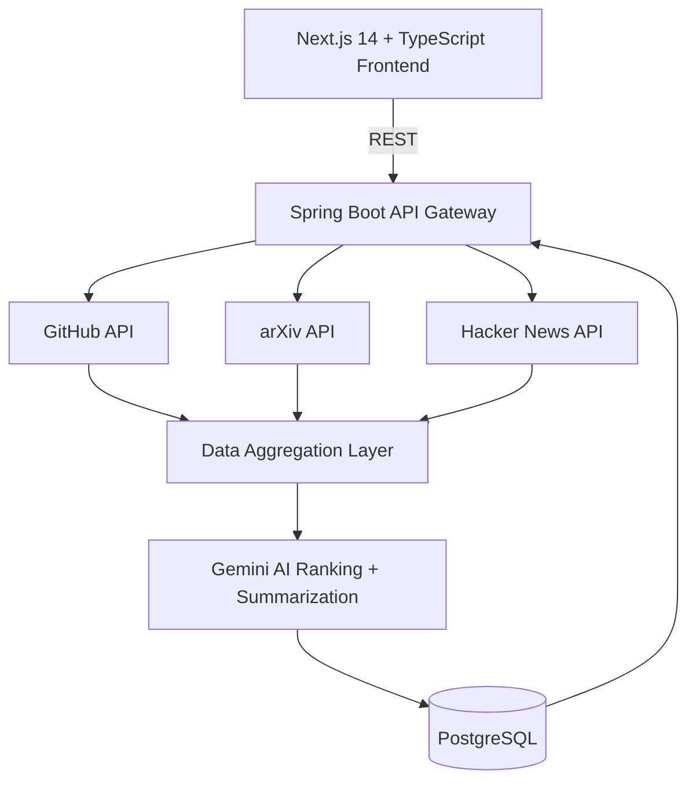

<div align="center">


Consolidate GitHub, arXiv, and Hacker News into one intelligently ranked feed. Vertex reads the internet's dev signal so you don't have to — surfacing what's actually important, not just what's newest.

[](https://github.com/26Utkarsh/Vertex/releases)
[](LICENSE)
[](https://openjdk.org/)
[](https://www.typescriptlang.org/)

**[📡 Live Demo](https://vertex-frontend-946u.onrender.com)** &nbsp;•&nbsp; **[📚 Docs](#documentation)** &nbsp;•&nbsp; **[🚀 Quick Start](#quick-start)** &nbsp;•&nbsp; **[🗺️ Roadmap](#roadmap)**


</div>

---

## Overview

Every developer knows the ritual: fifteen tabs open every morning — GitHub trending, arXiv new submissions, Hacker News front page — sifting for the handful of things that actually matter. **Vertex ends that ritual.**

It's not another feed. It's a ranking engine. Vertex ingests raw signal from multiple sources, runs it through an AI enrichment layer, scores it by relevance rather than recency, and hands you a single feed worth reading.

- 🎯 **Single unified interface** across GitHub, arXiv, and Hacker News
- 📊 **Relevance-based ranking**, not chronological noise
- 🤖 **AI summarization** — key insight, zero context-switching
- 🔗 **Cross-source deduplication** — one story, not three copies
- 🔖 **Search & bookmarking** for real knowledge management

---

## Technical Architecture

<div align="center">



</div>

### Technology Stack

| Layer | Component | Version | Notes |
|---|---|---|---|
| **Backend** | Java | 21 LTS | Type-safe, performant JVM runtime |
| **Framework** | Spring Boot | 3.x | Layered, production-grade structure |
| **Security** | Spring Security + OAuth 2.0 | — | Google OAuth + JWT |
| **Database** | PostgreSQL (Neon) | 14+ | Free-tier serverless Postgres |
| **ORM** | Spring Data JPA | — | Type-safe data access, Flyway migrations |
| **Frontend** | Next.js | 14 | App Router, SSR |
| **Language** | TypeScript | 5.0+ | Strict mode, end-to-end type safety |
| **Styling** | Tailwind CSS | 3.x | Utility-first |
| **AI** | Gemini API | Latest | Summarization + ranking signals |
| **Deployment** | Render | — | Backend + frontend, zero paid infra |

---

## Quick Start

### Prerequisites
- Java 21+
- Node.js 18+ / npm 9+
- PostgreSQL 14+
- Git

### Environment Setup

```env
SPRING_DATASOURCE_URL=jdbc:postgresql://localhost:5432/vertex_db
SPRING_DATASOURCE_USERNAME=postgres
SPRING_DATASOURCE_PASSWORD=your_password
GOOGLE_CLIENT_ID=your_client_id
GOOGLE_CLIENT_SECRET=your_client_secret
GEMINI_API_KEY=your_gemini_key
JWT_SECRET=your_jwt_secret_key
```

### Run

```bash
# Backend
cd backend
mvn clean test && mvn clean package
mvn spring-boot:run          # macOS/Linux
.\scripts\run-local.ps1      # Windows

# Frontend
cd frontend
npm install
npm run dev
```

Backend → `http://localhost:8080` · Frontend → `http://localhost:3000`

---

## API Reference

```
GET  /api/v1/feeds             Retrieve aggregated feed
POST /api/v1/bookmarks         Create bookmark
GET  /api/v1/bookmarks         List user bookmarks
POST /api/v1/preferences       Update ranking preferences
GET  /api/v1/search?q=term     Full-text search
```

---

## Project Structure

```
Vertex/
├── backend/
│   └── src/main/java/com/vertex/
│       ├── controller/   service/   model/   repository/   config/   security/
├── frontend/
│   └── app/   components/   lib/   types/   styles/
```

---

## Roadmap

**Phase 1 — Core MVP** ✅
Multi-source aggregation · AI ranking & summarization · Google OAuth · Bookmarks & search · Live deployment

**Phase 2 — Enhanced Intelligence** 🚧
Security vulnerability tracking · AI model release tracking · Dev tools directory · Context-aware assistant · Personalized digest

**Phase 3 — Community & Scale** 📋
Team collaboration · Custom source integration · Mobile app · Public API · Fine-tuned ranking model

---

<div align="center">

**[View Live Demo](https://vertex-frontend-946u.onrender.com)** • **[Report Bug](https://github.com/26Utkarsh/Vertex/issues)** • **[Request Feature](https://github.com/26Utkarsh/Vertex/issues)**

Built solo, on zero paid infrastructure, by [**26Utkarsh**](https://github.com/26Utkarsh)


</div>
