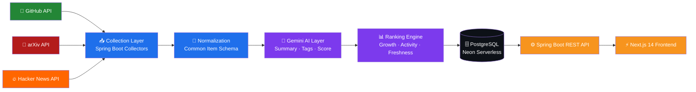

<div align="center">


<br/>


<br/><br/>

<a href="https://vertex-frontend-946u.onrender.com">
  
</a>
&nbsp;

&nbsp;

&nbsp;

&nbsp;

&nbsp;


<br/><br/>


</div>

<br/>

---

<div align="center">

## 💀 The Problem

</div>

```
Every morning, developers open:

  → GitHub Trending          (5 min)
  → arXiv new submissions    (10 min)
  → Hacker News              (10 min)
  → AI news blogs            (10 min)
  → Twitter/X tech threads   (10 min)
  → Random newsletters       (10 min)
                             ────────
                             45 min wasted · 3 things worth reading
```

<div align="center">

### ⚡ Vertex fixes this in 2 minutes.

</div>

<br/>

---

<div align="center">

## 🧠 How Vertex Works


</div>



<br/>

---

<div align="center">

## ✨ Features

</div>

<table>
<tr>
<td align="center" width="33%">
<br/>
<b>📡 Unified Feed</b><br/>
GitHub · arXiv · Hacker News in one ranked interface. Stop tab switching forever.
</td>
<td align="center" width="33%">
<br/>
<b>🤖 AI Summarization</b><br/>
Gemini reads every item. You get the insight in 10 seconds, not 10 minutes.
</td>
<td align="center" width="33%">
<br/>
<b>📊 Relevance Ranking</b><br/>
Custom score = growth velocity + activity + freshness. Not just "what's new."
</td>
</tr>
<tr>
<td align="center" width="33%">
<br/>
<b>🔗 Story Merging</b><br/>
Same breakthrough across 3 sources? Vertex merges it into one story automatically.
</td>
<td align="center" width="33%">
<br/>
<b>📝 Daily Brief</b><br/>
One AI paragraph. Everything important from the past 24 hours. Done.
</td>
<td align="center" width="33%">
<br/>
<b>🔖 Search & Bookmarks</b><br/>
Full-text search across everything. Save any item. Find it in seconds.
</td>
</tr>
</table>

<br/>

---

<div align="center">

## 🛠️ Tech Stack


</div>

<br/>

<div align="center">

| Layer | Technology | Details |
|:---:|:---:|:---|
| ☕ **Backend** | Java 21 + Spring Boot 3 | Layered architecture: controller → service → repository → entity |
| 🔐 **Auth** | Spring Security + Google OAuth + JWT | Stateless, no passwords stored |
| 🗄️ **Database** | PostgreSQL (Neon serverless) | Flyway migrations, JPA/Hibernate ORM |
| ⚡ **Frontend** | Next.js 14 App Router | TypeScript strict, Tailwind, SSR |
| 🤖 **AI** | Google Gemini API | Summarization, tagging, rank signals |
| ⏰ **Scheduler** | GitHub Actions (cron) | Auto-collects every 6 hours, free tier |
| 🚀 **Hosting** | Render | Backend + frontend, **$0/month** |
| 🔍 **Search** | PostgreSQL Full-Text Search | No external search service needed |

</div>

<br/>

---

<div align="center">

## 🚀 Quick Start

</div>

### 1. Clone
```bash
git clone https://github.com/26Utkarsh/Vertex.git && cd Vertex
```

### 2. Backend `.env.local`
```env
SPRING_DATASOURCE_URL=jdbc:postgresql://localhost:5432/vertex_db
SPRING_DATASOURCE_USERNAME=postgres
SPRING_DATASOURCE_PASSWORD=your_password
GOOGLE_CLIENT_ID=your_client_id
GOOGLE_CLIENT_SECRET=your_client_secret
GEMINI_API_KEY=your_gemini_key
GITHUB_TOKEN=your_github_pat
JWT_SECRET=your_32_char_secret
INTERNAL_API_KEY=your_32_char_secret
COLLECTOR_ENABLED=true
```

### 3. Run
```bash
# Backend
cd backend
mvn clean package && mvn spring-boot:run     # macOS/Linux
.\scripts\run-local.ps1                      # Windows

# Frontend
cd frontend && npm install && npm run dev
```

> Backend → `http://localhost:8080` · Frontend → `http://localhost:3000`

<br/>

---

<div align="center">

## 📁 Structure

</div>

```
Vertex/
├── 📁 .github/workflows/
│   └── collectors.yml          # ⏰ Auto-refresh every 6 hours
│
├── 📁 backend/
│   └── src/main/java/com/vertex/
│       ├── 🎮 controller/      # REST endpoints
│       ├── ⚙️  service/         # Business logic
│       ├── 🗃️  repository/      # JPA data access
│       ├── 📦 entity/           # DB models
│       ├── 📋 dto/              # Request/response shapes
│       ├── 🕷️  collector/       # GitHub · arXiv · HN collectors
│       ├── 🤖 ai/               # Gemini summarization
│       └── 🔐 auth/             # OAuth + JWT
│
└── 📁 frontend/
    ├── 📱 app/                  # Next.js App Router
    ├── 🧩 components/           # Reusable UI
    └── 📚 lib/                  # API client, utilities
```

<br/>

---

<div align="center">

## 🗺️ Roadmap

</div>

```
████████████████████████░░░░░░░░░░░░░░░░░░░░░░░░░░░  V1 COMPLETE ✅

  ✅ GitHub · arXiv · Hacker News feed
  ✅ Gemini AI summarization + ranking
  ✅ Google OAuth + JWT authentication
  ✅ Bookmarks + full-text search
  ✅ Daily brief + cross-source story merging
  ✅ GitHub Actions auto-collector cron
  ✅ Live on Render — $0 infrastructure

░░░░░░░░░░░░░░░░░░░░░░░░░░░░░░░░░░░░░░░░░░░░░░░░░░░  V2 BUILDING 🚧

  ○ Security vulnerability hub (NVD API)
  ○ AI model release tracking
  ○ Developer tools directory
  ○ AI assistant (context-aware, DB-grounded)
  ○ Personalized skip list + weekly digest

░░░░░░░░░░░░░░░░░░░░░░░░░░░░░░░░░░░░░░░░░░░░░░░░░░░  V3 PLANNED 📋

  ○ Team workspaces
  ○ Public API
  ○ Mobile app
  ○ Custom source integration
```

<br/>

---

<div align="center">


<br/>

**[📡 Live Demo](https://vertex-frontend-946u.onrender.com)** &nbsp;·&nbsp; **[🐛 Report Bug](https://github.com/26Utkarsh/Vertex/issues)** &nbsp;·&nbsp; **[💡 Request Feature](https://github.com/26Utkarsh/Vertex/issues)**

<br/>

Built by [**26Utkarsh**](https://github.com/26Utkarsh)


</div>
